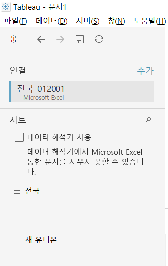
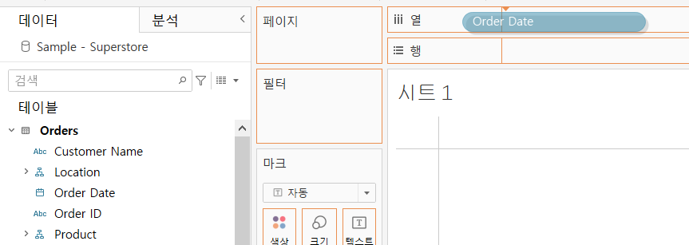

# Tableau
 - Data visualization Using Tableau
 - Learning with the [Tableau tutorial](https://help.tableau.com/current/guides/get-started-tutorial/ko-kr/get-started-tutorial-home.htm)
 
## Contents
1. [Using](#using)
2. [Overview and main features](#overview-and-main-features)
3. [Chart visualization](#chart-visualization)
4. [Use a simple view](#use-a-simple-view)
5. [Map visualization and drill down](#map-visualization-and-drill-down)
6. [Analysis practice](#analysis-practice)
7. [Dashboard, story creation and web sharing](#dashboard,-story-creation-and-web-sharing)

---------------------------------------------------------

## Using
1. Basic Data - **KOSIS** (국가 통계포털)
2. Data visualization tool - **Tableau**

---------------------------------------------------------

## Overview and main features
1. [Tableau](https://en.wikipedia.org/wiki/Tableau_Software)
    1. **다양한 데이터 소스(파일, 데이터베이스)**에 접근을 해서 데이터를 가져온 다음, 그 데이터를 잘 **처리해서 시각화**를 해주는 소프트웨어
    2. **데이터 시각화 도구**
2. 제품군
    1. **Tableau Desktop** - 1:1
    2. Tableau Server - 1:n
    3. Tableau Online - Tableau Cloud에 들어가서 사용할 수 있는 제품
3. **주요 기능**
    1. **다양한 소스 (파일 및 서버)와 연결 가능**
    2. **지도 자동 매핑 기능**
    3. **쉽고 간편하고 다양한 차트 시각화 기능**
    4. **Interactive 시각화 기능** : 매개변수 생성 - 계산된 필드 - 필터 적용
4. **Tableau Desktop** [다운로드](https://www.tableau.com/)

----------------------------------------------------------

## Chart visualization
1. [KOSIS](https://kosis.kr/publication/publicationThema.do) 국가 통계포털 Excel 데이터 사용
    - 온라인간행물 -\> "전국사업체조사"검색 -\> 시군구별 -\> 2019년기준자료 -\> 전국 Excel 다운로드
    

        
    

2. **Tableau**에서 위 **Excel 파일 열기**
    - 파일에 연결 -\> Microsoft Excel
    

        
    

    

        
    

3. **불필요한 데이터 삭제**
    - **데이터 해석기** 사용
    

        
    

    

        
    

4. **워크시트**로 이동
    

        
    

    

        
    

5.  다양하게 **차트 생성 및 사용** Ctrl+B : 차트 줄이기, Ctrl+Shift+B : 차트 키우기
    1. '총 사업체 수' 더블 클릭 -\> **행**
        

            
        

    2. '산업분류명칭' 더블 클릭 -\> **열**
        

            
        

    3. 막대에 **색상 입히기** ('산업분류명칭'을 색상별로 보기 위해)
        - '산업분류명칭' 드래그 -\> **마크의 색상에 드랍**
        

            
        

        

            
        

    4. **행과 열 바꾸기, 내림차순 (오름차순) 정렬**
        - 행과 열 바꾸기 버튼 클릭 (또는 **Ctrl + W**)
        - 내림차순, 오름차순 버튼 클릭 또는 **우측에 산업분류명칭 우클릭하여 정렬 가능**
        

            
        

        

            
        

        

            
        

        

            
        

    5. **필터 적용**하여 전체 산업 막대(전체를 더한 값) 삭제
        1. '산업분류명칭'을 드래그해서 **필터에 드랍**
            

                
            

        2. 전체산업 해제 후 적용
            

                
            

            

                
            

    6. **차트 명 변경** (하단 시트명 변경도 동일)
        - 제목 더블 클릭하여 수정
        

            
        

        

            
        

    7. 사업체 수를 **퍼센트로 변경**
        - 분석 -\> 백분율 -\> 테이블
        

            
        

        

            
        

    8. 시트를 **복사, 붙여넣기** 하여 쉽고 다양한 차트 생성이 가능
        

            
        

    9. 우측 상단에 **표현 방식을 이용하여 현재 차트를 다양한 차트로 변환 가능**
        

            
        

        

            
        

    10. **표** 내림차순
        - 값 우클릭 모두선택 -\> 마우스 Over -\> 선택
        

            
        

        

            
        

        

            
        

        

            
        

    11. **트리맵 차트**
        

            
        

    12. 저장하기
        1. 저장 : 차트만 저장
        2. **패키지 통합 문서 내보내기 : 외부에 있는 엑셀 데이터를 가져와서 차트를 작성했는데, 해당 엑셀 파일과 같이 저장하고 싶을 때 사용 (추천)**
        
---------------------------------------------------------

## Use a simple view
#### Tableau tutorial 1,2,3 단계
1. 목표
    - 회사의 전체 매출 및 수익성을 확인하고 개선이 필요한 주요 영역을 식별
    - 필터 및 색상을 사용하여 세부 정보를 보다 집중적으로 표시
2. Sample - Superstore 사용
    

        
    

    

        
    

    

        
    

    

        
    

3. 용어 설명
    1. 집계
        - 매출 합계 또는 총 수익과 같은 상위 범주로 롤업된 행 수준 데이터
        - Tableau에서는 자동으로 집계가 수행되므로 작업하려는 세부 정보 수준으로 데이터를 분리할 수 있다.
    2. 차원 및 측정값 가장 중요
        - 차원은 이름 또는 날짜와 같은 **질적 데이터**
        - 기본적으로 Tableau에서는 질적 정보 또는 범주형 정보가 포함된 데이터가 차원으로 분류
        - 텍스트 또는 날짜 값이 포함된 모든 필드를 예로 들 수 있다. 이러한 필드는 일반적으로 데이터 행의 열 머리글로 표시되며(예: Customer Name 또는 Order Date), 뷰에 표시되는 세부 수준을 정의한다.
        - 측정값은 **양적 숫자 데이터**
        - 기본적으로 Tableau에서는 이러한 종류의 데이터가 포함된 모든 필드가 측정값으로 처리된다(예: 매출 거래 또는 수익).
        - 측정값으로 분류된 데이터는 지정된 차원을 기준으로 집계될 수 있다. 예를 들어 총 매출(측정값)을 지역(차원)별로 집계할 수 있다.
    3. 연속형 및 불연속형
        - 연속형 필드에는 무한한 수의 값이 포함될 수 있다.
        - 예를 들어 특정 날짜 범위 내 매출 또는 수량과 같은 값 범위가 포함될 수 있다.
        - 연속형 필드는 Tableau에서 녹색으로 표시된다.
        - 불연속형 필드에는 국가, 주, 고객 이름 등 한정된 수의 값이 포함된다.
        - 불연속형 필드는 Tableau에서 파란색으로 표시됩니다.
4. Tableau UI 중에서
    1. 데이터 패널
        - 뷰에 포함된 데이터 원본의 이름이 표시되고 사용 가능한 필드가 차원 및 측정값으로 표시된다.
        - 필드는 소유하는 테이블을 기반으로 또는 폴더를 기준으로 그룹화할 수 있다.
        

            
        

    2. 카드 및 선반
        - 카드는 Tableau에서 사용할 수 있는 다양한 컨트롤이 포함된 컨테이너다.
        - 선반은 카드 컨트롤의 유형이다. 데이터 패널의 필드를 열 또는 행 선반으로 끌어오면 데이터가 열 또는 행으로 뷰의 축에 추가된다.
        - 데이터 패널의 필드를 마크 카드로 끌어오면 유형, 색상, 크기, 모양 등의 시각적 속성을 제어할 수 있다. 이 작업은 뷰의 마크에만 영향을 미치며 축은 변경되지 않는다.
        

            
        

        

            
        

5. 학습
    1. 데이터 패널에서 Order Date(주문 날짜)를 열 선반으로 끌어온다.
        

            
        

        

            
        

    2. 데이터 패널에서 Sales(매출)을 행 선반으로 끌어온다.
        

            
        

    3. 뷰 구체화 - 데이터 패널에서 Category(범주)를 열 선반으로 끌어 YEAR(Order Date)의 오른쪽에 배치한다. (카테고리별 추이 파악)
        

            
        

    4. 레이블 추가하기
        

            
        

    5. 데이터 패널에서 Sub-Category(소범주)를 열 선반으로 끌어 Category의 오른쪽에 배치한다.
        

            
        

    6. Sub-Category를 각각의 Category 막대 차트에 포함시켜 표현하기
        - Sub-Category를 드래그해서 마크 카드의 색상에 드랍
        

            
        

        

            
        

    7. 뷰에 값을 포함하거나 제외시킬 수 있는 필터 추가하기
        - 특정 연도의 하위 범주별 제품 매출을 보다 쉽게 볼 수 있도록 단순 필터 2개 추가
        - 데이터 패널에서 Order Date를 드래그해서 필터 카드에 드랍 -\> 날짜범위, 년 체크 -\> 최근 2년만 체크하고 나머지 체크 해제하고 확인
        - 데이터 패널에서 Sub-Category를 드래그해서 필터 카드에 드랍 -\> 원하는 항목만 체크해서 필터링
        

            
        

        

            
        

        

            
        

        

            
        

    8. 뷰에 색상을 추가하여 여러 제품의 전체 수익성 보기
        - 데이터 패널에서 Profit(수익)을 마크 카드의 색상으로 드래그, 드랍
        - 매출 정보는 막대의 크기로, 수익성은 막대의 색상으로 비교 가능
        - 색상을 통해서 수익성이 떨어지는 Sub-Category를 볼 수 있다.
        

            
        

    9. 수익성이 낮다고 예측되는 제품이 매년 수익성이 없었는지 확인
        - 뷰의 Sub-Category 필터 카드에서 Bookcases, Machines 및 Tables를 제외한 다른 모든 Sub-Category 체크를 해제
        

            
        

        

            
        

    10. Sub-Category 필터 카드에서 모두를 선택하여 다시 모든 하위 범주 표시
    11. 데이터 패널에서 Region(지역)을 행 선반으로 끌어 합계(Sales) 왼쪽에 위치시킨다.
        

            
        

    12. 우측의 Panel에 우클릭을 하여 빠른 필터링도 가능하다
        

            
        

        
---------------------------------------------------------

## Map visualization and drill down
#### Tableau tutorial 4, 5단계
1. 목표
    - South 지역의 제품 매출 및 수익성을 살펴본 후 해당 지역의 추세 또는 패턴 찾기
    - 수익이 음수인 지역을 찾고, 그 이유를 찾기 위해 추가 정보를 드릴다운하고 분석하기
2. 맵 뷰
    - 지도 시각화, 지리적 데이터 (위도, 경도)
3. 지리적 역할 충족
    - Tableau는 시/도 및 구/군/시 이름 같은 많은 일반적인 지리적 데이터를 인식
    - Tableau에서 이러한 유형의 데이터가 인식되면 해당하는 지리적 역할이 자동으로 필드에 할당되고 해당 필드가 지리적 필드가 된다.
    - 지리적 필드는 데이터 패널에서 옆에 지구본 아이콘이 나타난다.
    - 지리적 역할이 할당된 필드를 마크 카드의 세부 정보에 추가하면 자동으로 맵 뷰가 만들어진다.
    - Tableau에서 지리적 데이터로 인식되지 않는 데이터의 경우 관련 필드 각각에 수동으로 지리적 역할 (공항, 지역 번호, 구/군/시, 국가/지역 등) 을 할당할 수 있다.
    

        
    

4. 학습
    1. 맵 뷰 작성
        - 데이터 패널에서 State를 두 번 클릭하여 마크 카드의 세부 정보에 추가
        - Tableau에서 시/도 이름은 지리적 데이터로 인식되고 State 차원에는 주/시/도 지리적 역햘이 할당되므로 자동으로 맵 뷰가 만들어진다.
        - Contry 필드도 뷰에 추가된 것을 알 수 있는데 Sample-Superstore의 지리적 필드가 계층의 일부이기 때문이다. 계층의 각 수준이 양파의 겹처럼 세부 수준으로 추가된다.
        

            
        

    2. 필터링
        - Region을 필터 선반으로 끌어 놓은 다음 South로만 필터링한다.
        

            
        

        

            
        

    3. 색상 표시
        - Sales 측정값을 마크 카드의 색상으로 끌어 놓기
        - Sales 색상을 삭제하고 Profit을 색상으로 끌어 놓기
        

            
        

        

            
        

    4. 색상 변경
        - 마크 카드의 색상을 클릭한 다음 색상 편집 선택
        - 빨간색-녹색 다중 선택
        - 테네시, 노스캐롤라이나 및 플로리다의 수익이 음수인 것을 확인할 수 있다.
        

            
        

        

            
        

    5. 막대 차트는 핵심을 파악하는데 도움이 된다. 이를 위해 현재 시트를 복제하여 새로운 워크 시트를 추가로 만들고 진행한다.
        

            
        

    6. 새로 만든 워크 시트에서 표현 방식을 클릭한 다음 가로 막대를 선택한다.
        

            
        

    7. Tennessee, North Carolina 및 Florida의 막대 전체를 클릭하고 끌어 왼쪽에 있는 여러 막대를 선택한다. 도구 설명이 표시되면 이 항목만 포함을 선택하여 3개 주에 집중한다. (필터 카드를 사용한 것과 같은 기능)
        

            
        

        

            
        

        

            
        

    8. 행 선반에서 State 필드의 더하기 아이콘을 클릭하여 City 수준의 세부정보로 드릴다운한다. (City를 행 선반에 드래그, 드랍한 것과 같은 기능)
        

            
        

    9. 문제 항목 식별하기
        - 뷰를 Sub-Category로 구분하여 수익을 끌어내리는 제품을 식별한다.
        - Sub-Category를 행 선반으로 끌어 City 오른쪽에 배치한다.
        - 음수 수익을 낸 제품을 쉽게 확인할 수 있도록 Profit을 마크 카드의 색상으로 끌어 놓는다.
        - 데이터 패널에서 Order Date를 마우스 우클릭하고 필터 표시를 선택한다.
        - 이제 필요한 경우 연도별로 음수 수익을 탐색하고 손해가 나는 제품을 신속하게 발견할 수 있다.
        

            
        

    10. 이전의 맵 뷰 워크 시트로 이동하여 결과 확인하기
        - Label 추가하기 : 데이터 패널에서 원하는 데이터를 마크 카드의 레이블에 드래그, 드랍
        - 서식 변경하기 : 마크 카드의 레이블 데이터 우클릭 -\> 서식
        - Profit Ratio : 원본 데이터에는 존재하지 않는다. 이 값은 Profit 데이터와 Sales 데이터를 통해서 Tableau에서 만들어 낼 수 있다. ('=#'으로 표시된 값은 Tableau에서 만들어낸 값)
        

            
        

        

            
        

        

            
        

        

            
        

    11. 최종 차트
        

            
        

        
---------------------------------------------------------

## Analysis practice

---------------------------------------------------------

## Dashboard, story creation and web sharing